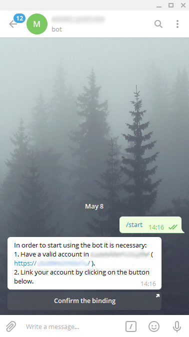
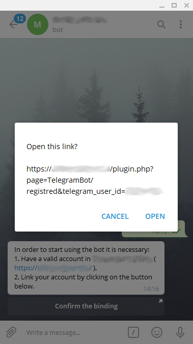
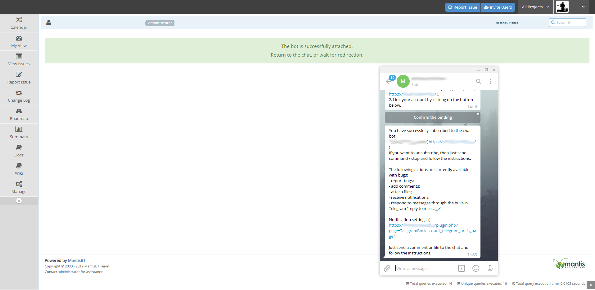
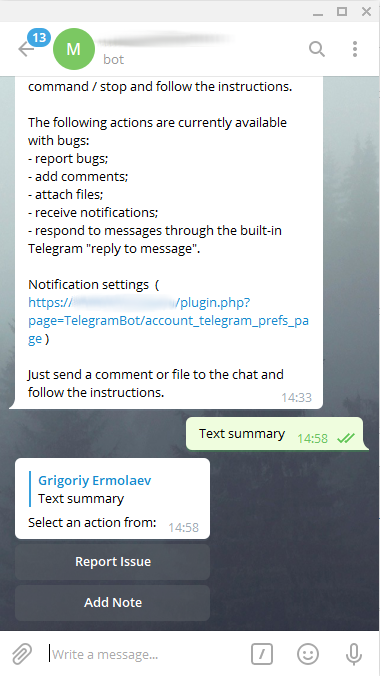
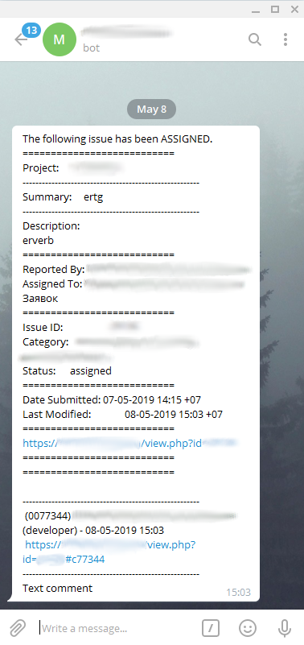
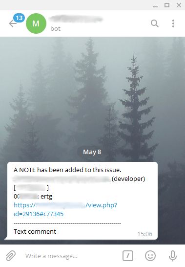

# MantisBT TelegramBot Plugin

Overview
--------
This is a bot for the Telegram messenger.

Screenshots
-----------

Features
--------
- Report bugs (v. >= 1.1);
- Attach files to bugs;
- Send comments to bugs;
- Receive notification when (v. >= 1.2): 
    - creating an bug;
    - change the status of the bug;
    - adding a comment to the bug;
    - mention of the user in the commentary.
- Respond to chat alerts about events using the built-in function "Reply to message". The answer will be added as a comment to the bug (v. >= 1.3);
- Support SOCKS5 proxy server ( Requires curl >= 7.21.7 ).

Download
--------
Please download the stable version.
(https://github.com/mantisbt-plugins/TelegramBot/releases/latest)

How to install
--------------

1. Copy TelegramBot folder into plugins folder.
2. Open Mantis with browser.
3. Log in as administrator.
4. Go to Manage -> Manage Plugins.
5. Find TelegramBot in the list.
6. Click Install.
7. Click TelegramBot link
8. Follow the instructions.

Supported Versions
------------------

- MantisBT 2.14 to 2.26 - supported in plugin version up to 1.5.x
- MantisBT 2.26 and higher - supported in plugin version 1.6 and higher
- Only https ssl certificate signed trusted ca is supported for MantisBT ( In the near future, a self-signed https certificate will be supported. )
