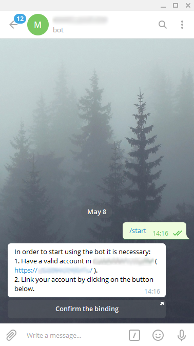
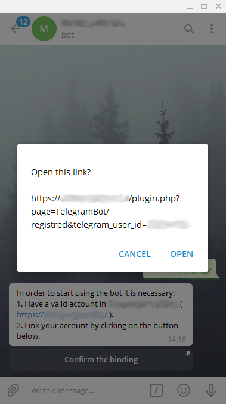
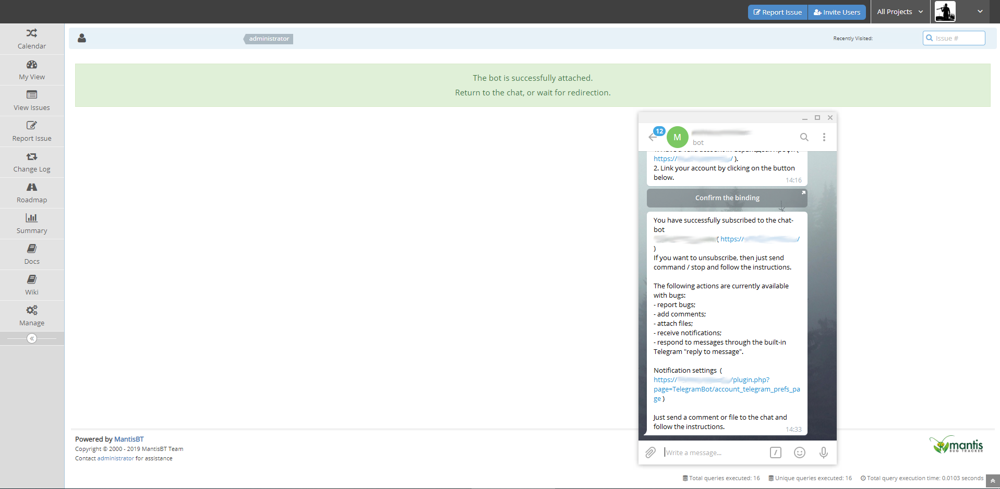
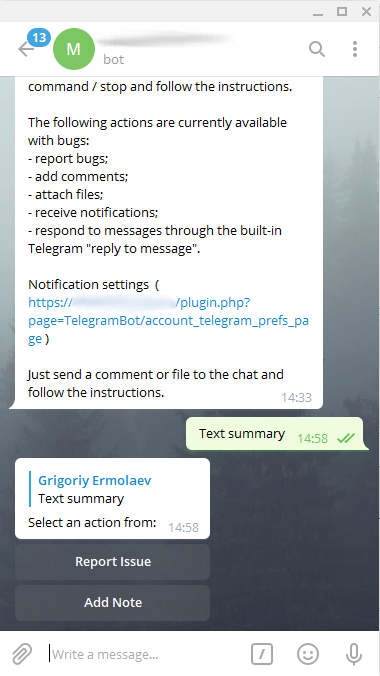
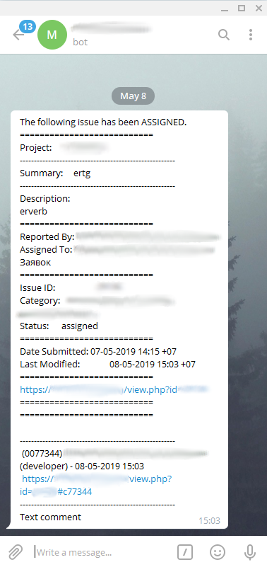
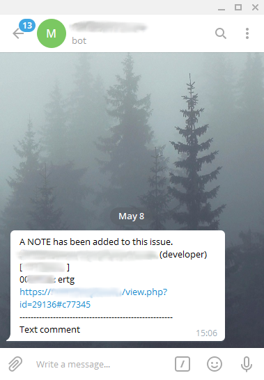

# MantisBT TelegramBot Plugin

[](https://gitter.im/mantisbt-plugins/TelegramBot?utm_source=badge&utm_medium=badge&utm_campaign=pr-badge&utm_content=badge)

Overview
--------
This is a bot for the Telegram messenger.

Screenshots
-----------








Features
--------
- Report bugs (v. >= 1.1);
- Attach files to bugs;
- Send comments to bugs;
- Receive notification when (v. >= 1.2): 
    - creating an bug;
    - change the status of the bug;
    - adding a comment to the bug;
    - mention of the user in the commentary.
- Respond to chat alerts about events using the built-in function "Reply to message". The answer will be added as a comment to the bug (v. >= 1.3);
- Support SOCKS5 proxy server ( Requires curl >= 7.21.7 );
- Two ways of getting updates from Telegram: webhook and long polling (v. >= 2.0);
- Two ways of linking a Telegram account to a MantisBT one: a confirmation link, or a PIN code shown in the chat and entered in MantisBT (v. >= 2.0);
- Unlink a Telegram account: with the `/stop` command in the chat, from the user's own account page, or by an administrator (v. >= 2.0);
- Broadcast a message with attached files to the Telegram chats of the members of chosen projects (v. >= 2.0);
- Guided issue creation covering every field of the report form (v. >= 2.0):
    - custom fields of all MantisBT types, including the ones defined by third party cfdef files;
    - the required fields are asked first, then the issue can be created right away or the optional fields filled in;
    - inline navigation: go back to any answered step, skip any optional field;
    - an inline calendar for the date fields with the month, year and twelve year views;
    - required fields and value formats are validated right in the dialog.
- Update an issue from the chat: pick it by project and filter, then change its status the way the status change page of MantisBT does (v. >= 2.0);
- Integration with the [Calendar](https://github.com/mantisbt-plugins/Calendar) plugin, version 3.0.0 or higher (v. >= 2.0):
    - create calendar events from the chat;
    - notifications about the events created, changed and deleted, the members added and removed, and the replies to the invitations, optionally with the event file (.ics) attached;
    - reply to an invitation, choose the reminders and put off a reminder with the buttons under the notification.

The bot works in private chats only: messages and button presses coming from groups and channels
are ignored, since the menus and the lists of issues are personal.

Download
--------
Please download the stable version.
(https://github.com/mantisbt-plugins/TelegramBot/releases/latest)


How to install
--------------

1. Copy TelegramBot folder into plugins folder.
2. Open Mantis with browser.
3. Log in as administrator.
4. Go to Manage -> Manage Plugins.
5. Find TelegramBot in the list.
6. Click Install.
7. Click TelegramBot link
8. Follow the instructions.

Getting updates: Webhook or Script
----------------------------------

Telegram delivers updates to a bot in one of two ways, chosen in the plugin settings
(*Manage -> Manage Plugins -> TelegramBot -> Settings*, option **Getting updates method**).

**Webhook** - Telegram servers connect to your MantisBT instance themselves, so it has to be
reachable from the Internet over HTTPS. The certificate may be either issued by a trusted CA or
self-signed: in the latter case upload the public certificate (`.pem`, `.crt`, `.cer`) on the
settings page, and the plugin passes it to Telegram when installing the webhook. Updates arrive
instantly and nothing has to be scheduled.

The webhook URL carries no credentials: on installing the webhook the plugin generates a random
secret, Telegram sends it back in the `X-Telegram-Bot-Api-Secret-Token` header of every update,
and a request without the right secret is refused. A webhook installed by a 1.x version of the
plugin still has the bot token in its URL, where it ends up in the web server logs; it keeps
working after the update, with a warning on the settings page, until the settings are saved -
saving them reinstalls the webhook with a secret.

**Script** (long polling) - MantisBT asks Telegram for updates itself, over an outgoing HTTPS
connection only - no certificate of your own is involved. Use it when publishing MantisBT on the
Internet is not possible. Add the script shown on the settings page to your scheduler, for
example:

```
* * * * * /usr/bin/php <mantisbt>/plugins/TelegramBot/scripts/telegram_get_updates.php >/dev/null 2>&1
```

A single run keeps a connection to Telegram open and processes updates as soon as they arrive, so
the schedule above is not a polling interval - it only restarts the script for the next minute.
Two settings control the timing, both on the settings page in the Script mode:

- **Long polling timeout** (25 s by default) - how long Telegram holds the connection while there
  are no updates. It has to stay below the server response timeout, otherwise curl gives up before
  Telegram answers.
- **Run time** (55 s by default) - how long a single run works before exiting. Keep it below the
  interval between runs; a run started while another one is still working exits immediately.
  Setting it to 0 makes the script poll once and exit.

Only one instance runs at a time - Telegram rejects parallel getUpdates calls with 409 Conflict.
The page *Telegram API status* shows when the script was last started, which is the way to tell
that the scheduler entry actually works. Note that both methods are mutually exclusive: while a
webhook is set, getUpdates returns 409 Conflict, so switching to Script deletes the webhook.

For the Script mode the URL of your MantisBT instance must be known: in CLI it cannot be derived
from the request, and the bot puts it into the links it sends. Set `$g_path` in `config_inc.php`,
or fill the URL field on the settings page if MantisBT is published under a different name for
external users.

**Connection debug mode** (settings page) writes the whole exchange with Telegram, messages of the
users included, to the file given in **Path to log file**. Only a `.log` or `.txt` file in an
existing directory outside the web root is accepted, and a file created by the plugin is readable
by its owner only. Files received from Telegram are downloaded to a directory of their own inside
the temporary directory of the system, readable by the web server user only, and removed as soon
as they are attached to the issue.

Linking accounts: Link or PIN code
----------------------------------

Before a Telegram user can report anything, his chat has to be linked to a MantisBT account. How
that binding is confirmed is chosen in the plugin settings (*Manage -> Manage Plugins -> TelegramBot
-> Settings*, section **Account linking settings**, option **How users link their accounts**).

<!-- SCREENSHOT: plugin settings page, the "Account linking settings" section -->

**Link** - the bot sends a button leading to a MantisBT page, where the user, already logged in,
confirms the binding in one tap. This requires MantisBT to be reachable from the device Telegram
runs on, usually a phone - which rules the method out for an instance published on the local
network only.

The link is good for one use within 15 minutes, and a new invitation cancels the previous one.
The confirmation page names the Telegram account about to be linked and the MantisBT account it
will act for; answering **No** cancels the link. A link received from somebody else must never be
confirmed: the Telegram account of its sender would then work in the bot on your behalf.

**PIN code** - the bot shows a 4-digit code in the chat, and the user enters it on the *Telegram
binding* page of his MantisBT account (*My Account -> Telegram binding*). Nothing has to be opened
from the phone, so this is the method for an instance that is not published to the Internet. The
code is valid for 15 minutes; sending any message to the bot issues a new one, and entering a code
that has just expired makes the bot send a fresh one to the chat by itself.

<!-- SCREENSHOT: the invitation with a PIN code as it looks in the chat -->
<!-- SCREENSHOT: the "Telegram binding" page with the code entered -->

**Link and PIN code** - the invitation carries both, and the user takes whichever works for him.

Whichever method is chosen, a binding is never replaced silently: a chat already linked to
another MantisBT account is released by its owner with the `/stop` command, and a MantisBT account
already linked to a Telegram account is unlinked on its *Telegram binding* page before another
one can be linked. The invitation is
deleted from the chat as soon as the accounts are linked, so an unused code does not stay on
screen; when the PIN code method is active, an invitation link sent earlier leads to a page saying
so instead of binding anything.

Entering wrong PIN codes is rate limited: after the configured number of wrong attempts within the
lockout window the page refuses further codes until the window ends. Both the limit and the window
are plugin settings; active lockouts are listed on the *Status of the Telegram API* page, each with
a reset button.

Unlinking
---------

A binding is released in one of three ways:

- **From the chat** - the `/stop` command unsubscribes the chat from the notifications and
  releases the binding.
- **By the user** - the *My Account -> Telegram binding* page shows the linked account with an
  **Unlink** button next to it. This is the way to go when the Telegram account is lost or has
  changed hands, so the `/stop` command is out of reach; the chat is told it was unsubscribed.
- **By an administrator** - the *Status of the Telegram API* page lists the linked users, each
  with an **Unlink** button. Whether the chat is told about the unlink is decided by a checkbox on
  the confirmation page - a lost account deserves the notice, a cleanup of stale bindings does not;
  the **Tell the user when an administrator unlinks his account** setting only chooses the state
  the checkbox starts in.

Deleting a MantisBT account releases its binding as well, silently: the account is gone, so there
is nothing to invite the chat back to. In every case the chat itself keeps working as an unlinked
one and offers to link an account on the next message.

Broadcast messages
------------------

A user can send a one-off message - text and files - from MantisBT to the Telegram chats of all
members of the chosen projects at once. The feature is off by default and is configured on the
*Broadcast* tab of the plugin pages: users at or above the configured access level may broadcast
to every project, any other user - only to the projects explicitly granted to him there. Everybody
allowed to broadcast to at least one project gets the *Send message* entry in the MantisBT menu.

The recipients are the enabled members of the selected projects who have linked their Telegram
accounts; the message opens with a header naming the sender, in the language of each recipient.

<!-- SCREENSHOT: the "Send message" page with projects, a message and files chosen -->
<!-- SCREENSHOT: the broadcast message as it looks in the chat -->

Calendar plugin integration
---------------------------

With the [Calendar](https://github.com/mantisbt-plugins/Calendar) plugin of version 3.0.0 or higher
installed, the plugin pages get the *Calendar plugin integration* tab. The integration is off by
default; once it is switched on there:

- the action list of the bot offers **Create an event** - a dialog asking for the project, the
  name, the description, the dates, the linked issues and the members, with the same inline
  calendar as the issue dialog. The access levels of Calendar apply as they do on its own pages;
- the bot notifies about the events the same way it does about issues, whether the event was
  changed from the chat or from the Calendar pages. Who is notified of what is set by a matrix on
  the same tab, globally or per project, and every user may switch each kind of notification off on
  his *My Account -> Telegram settings* page;
- the event file (.ics) may go along with the notifications: never, for everybody unless a user
  switches it off, or only for those who switch it on;
- the reminders of Calendar are repeated in the chat, and the buttons under a notification answer
  the invitation, pick the reminders or put off the one just received.

An older Calendar is treated as absent: the tab and the **Create an event** action are not shown.

Supported Versions
------------------

- MantisBT 2.14 to 2.25 - plugin version 1.5.x, which receives fixes only;
- MantisBT 2.26 to 2.27.2 - plugin version 1.6.0, which is not developed any more. It cannot be
  installed on MantisBT 2.27.3 and higher, where the ADOdb shipped with the core rejects one of
  the schema steps of the plugin - use version 2.x there;
- MantisBT 2.26 and higher - plugin version 2.x, the current line, verified up to MantisBT 2.28.4;
- The plugin declares no PHP version of its own: the minimum is the one required by the MantisBT
  release it runs on - PHP 7.2.5 for MantisBT 2.26.x and PHP 7.4.0 for 2.27.0 and higher. Tested
  up to PHP 8.4;
- The Calendar plugin is optional; the integration with it requires Calendar 3.0.0 or higher;
- The Webhook mode requires MantisBT itself to be reachable from the Internet over HTTPS, with a
  certificate from a trusted CA or a self-signed one uploaded on the settings page. The Script
  mode needs no certificate of its own and no inbound access: the plugin talks to
  api.telegram.org over an outgoing HTTPS connection.
